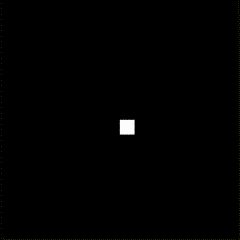

# Snake for MOS 6502

## About

This is a minimalist implementation of the classic Snake game, developed for the MOS 6502 microprocessor using its assembly language.  The project demonstrates the fundamentals of game programming on limited hardware, focusing on efficient use of memory and CPU cycles.

## Key features

Core gameplay mechanics for Snake (growing tail, collisions, etc.).
Optimized assembly code tailored for the MOS 6502.
A compact and retro gaming experience.

## Controls

The game is controlled using the keyboard arrow keys for easy navigation.

## How to Play

1) Load the ROM into your emulator.  
2) Make sure the NMI (Non-Maskable Interrupt) is available and activated on VSync (this is used to time the game).  
3) Ensure the stack is reset to avoid any issues with game execution.  
4) Once everything is ready, simply press any direction on the arrow keys to start the game.
